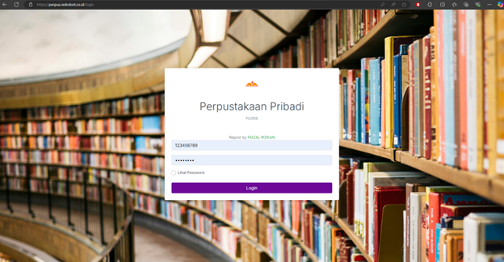
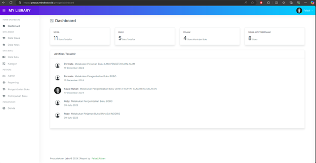

# Laravel Perpustakaan Pribadi

Laravel Perpustakaan Pribadi adalah aplikasi manajemen perpustakaan sederhana yang memungkinkan pengguna untuk melakukan login, melihat detail mahasiswa, dan mengakses fitur-fitur perpustakaan.

## 📸 Tangkapan Layar
### Halaman Login


### Halaman Dashboard


---

## 📋 Fitur
1. **Autentikasi Pengguna**: Login untuk NIP dan password.
2. **Detail Mahasiswa**: Menampilkan informasi mahasiswa (NIM, nama, kelas, mata kuliah).
3. **Dashboard Petugas**: Akses khusus untuk pengguna dengan tipe *Petugas*.
4. **Responsive UI**: Desain yang responsif dan mudah digunakan.

---

## 🚀 Instalasi

### Persyaratan
Pastikan Anda memiliki:
- PHP >= 8.0
- Composer
- MySQL/MariaDB
- Node.js & NPM
- Git

## Langkah - langkah
### Clone repository:
   ```bash
   git clone https://gitlab.com/username/repository-name.git
   cd repository-name
   ```
### Install dependensi:
  ```bash
   composer install
   npm install
  ```

### Copy file .env:

```bash
cp .env.example .env
Atur konfigurasi database di .env:
DB_CONNECTION=mysql
DB_HOST=127.0.0.1
DB_PORT=3306
DB_DATABASE=perpus_db
DB_USERNAME=root
DB_PASSWORD=yourpassword

```
### Generate kunci aplikasi:

```bash
Salin kode
php artisan key:generate
```
### Migrasi database dan seed data:
```bash
php artisan migrate --seed
atau
restore db dump 
```
### Jalankan aplikasi:

```bash
php artisan serve
```
### Buka di browser:
```arduino
http://127.0.0.1:8000
```
🐳 Docker (Opsional)
Build dan jalankan container:

```bash
docker-compose up -d
```
### Akses aplikasi:
``` arduino
http://localhost:8089
```
📂 Struktur Direktori Penting
app/: Folder untuk kode logika aplikasi (controller, model, dll).
resources/views/: Folder untuk file Blade (template frontend).
routes/web.php: Definisi route aplikasi.
public/: Folder untuk file publik seperti CSS, JS, dan gambar.
🛠 Pengembangan
Menjalankan Perintah Artisan
Gunakan perintah berikut untuk menjalankan berbagai tugas Laravel:

```bash
Salin kode
php artisan <command>
```
Contoh:
Menghapus cache: php artisan cache:clear
Memperbarui config: php artisan config:cache

💡 Catatan
Akses :

NIP: 123456789
Password: P4ssword

Pastikan direktori storage dan bootstrap/cache dapat ditulis:

```bash
chmod -R 775 storage bootstrap/cache
```
📝 Lisensi
Proyek ini menggunakan lisensi MIT. Silakan cek file LICENSE untuk informasi lebih lanjut.
